# T03 模型检查图

按物件和原始 GLB 的 SHA-256 分版保存。三栏依次为源图、实际模型斜视、实际模型俯视；这些图片仅用于复核，上传不等于验收通过。

## T03-01 供桌或主题主台

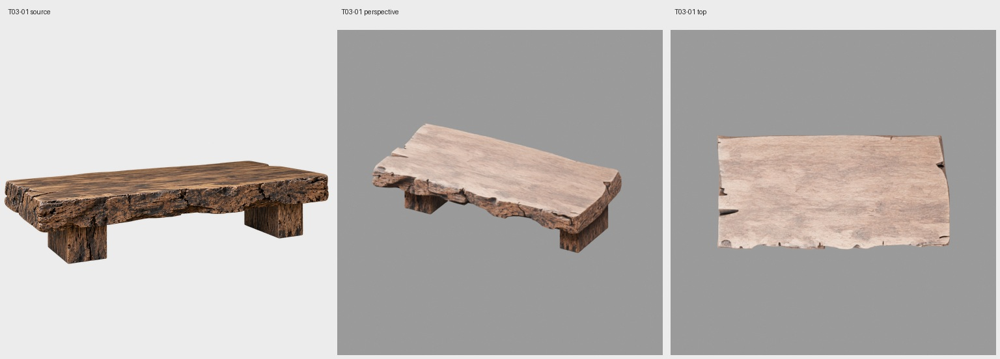

适配版：

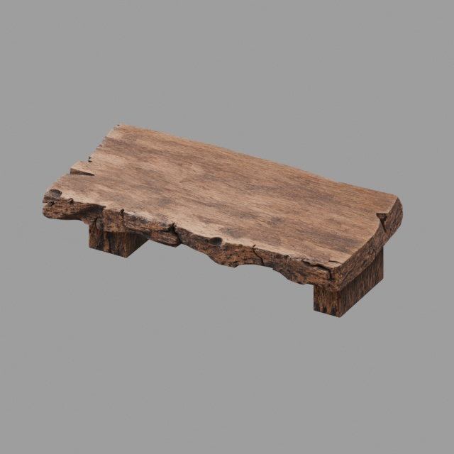

## T03-02 坐佛

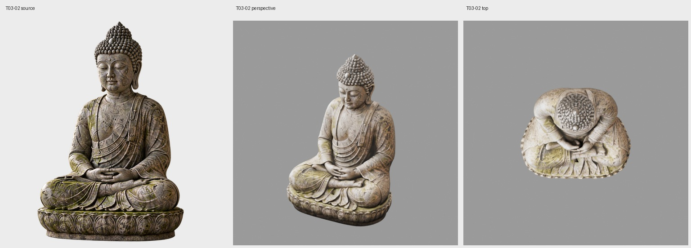

## T03-04 空花瓶

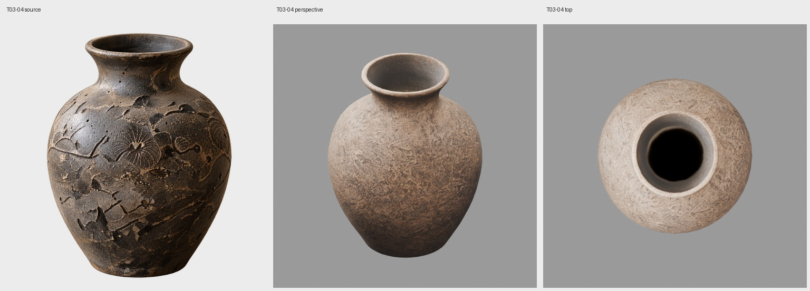

适配版：

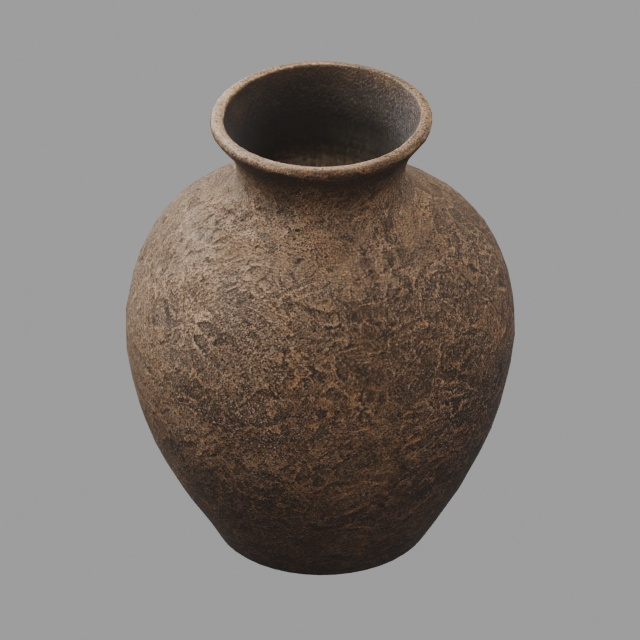

## T03-05 花枝花束

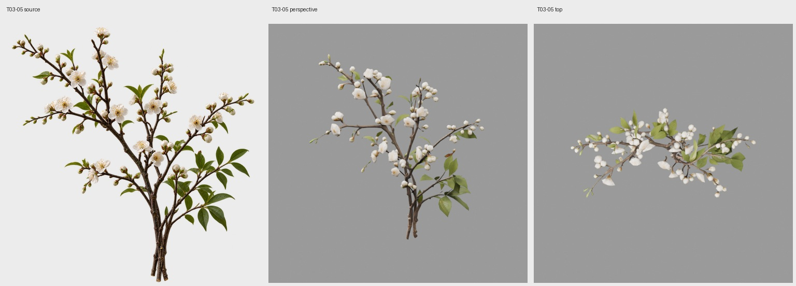

适配版：

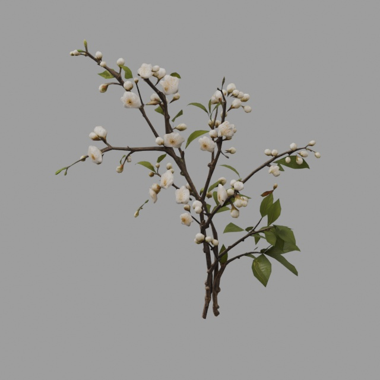

## T03-06 空烛台或灯盏

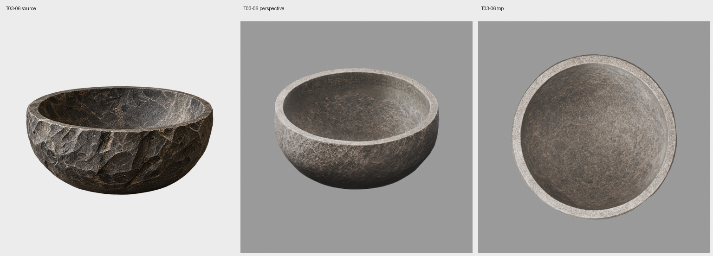

适配版：

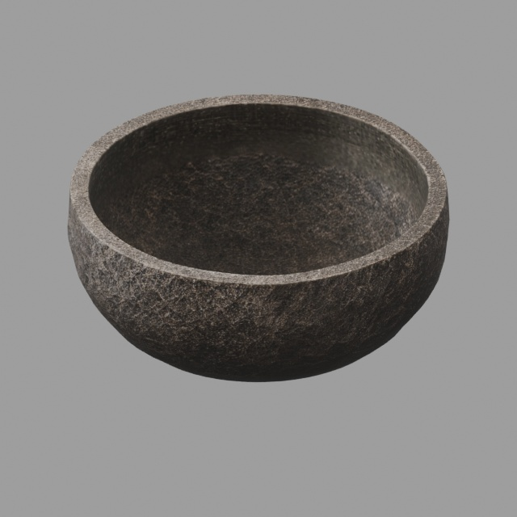

## T03-07 未点燃蜡芯

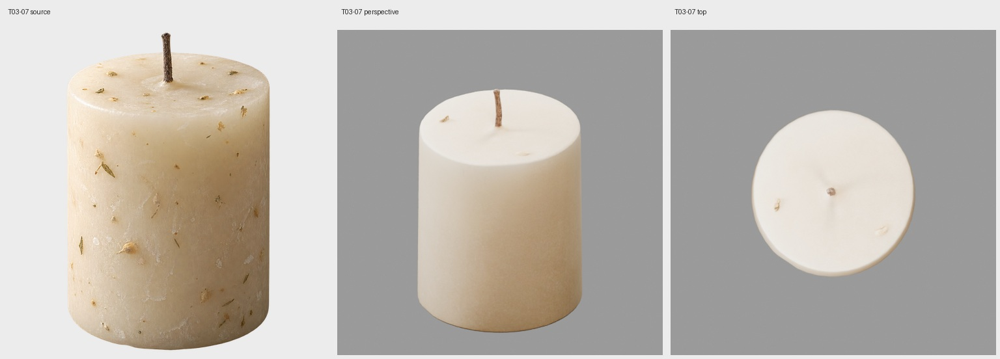

适配版：

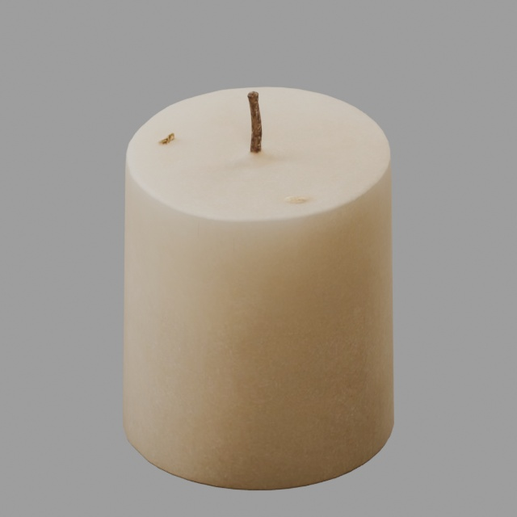

## T03-08 空香炉

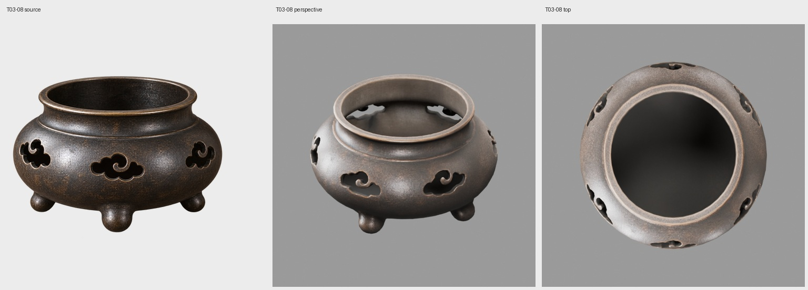

适配版：

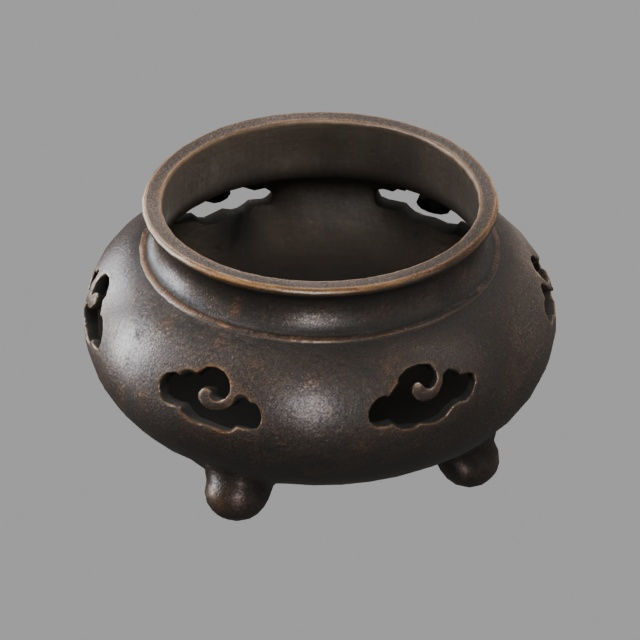

## T03-09 未点燃线香

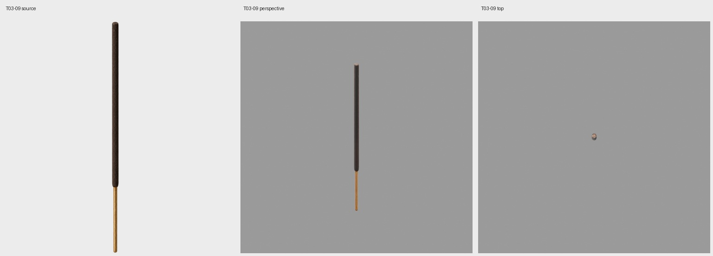

## T03-12 茶壶

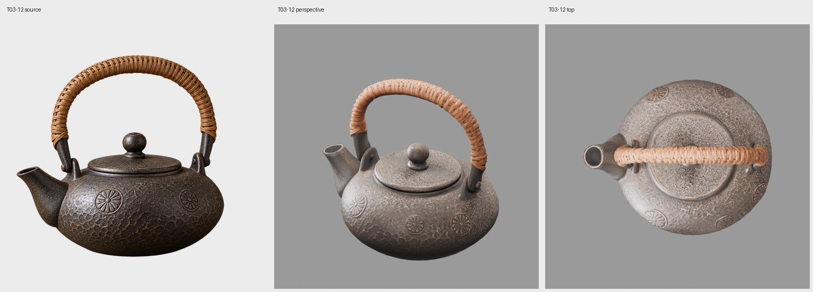
