# T03 模型检查图

按物件和原始 GLB 的 SHA-256 分版保存。三栏依次为源图、实际模型斜视、实际模型俯视；这些图片仅用于复核，上传不等于验收通过。

## T03-01 供桌或主题主台

适配版：

## T03-02 坐佛

## T03-04 空花瓶

适配版：

## T03-05 花枝花束

适配版：

## T03-06 空烛台或灯盏

适配版：

## T03-07 未点燃蜡芯

适配版：

## T03-08 空香炉

适配版：

## T03-09 未点燃线香

适配版：

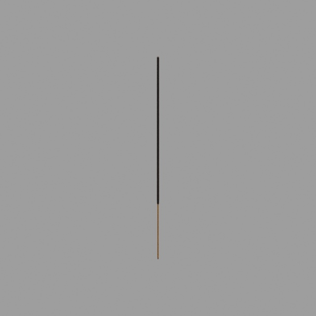

## T03-12 茶壶

适配版：

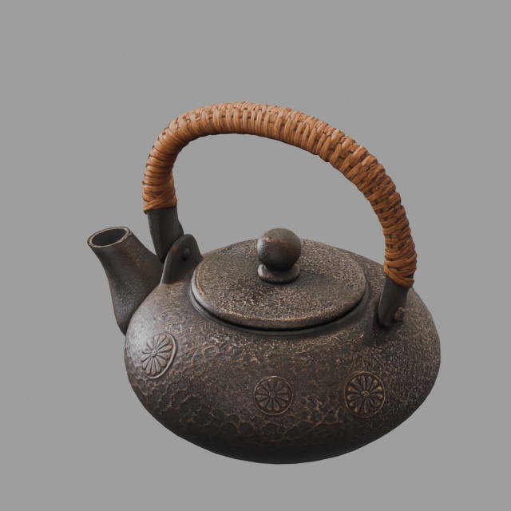

## T03-13 空茶杯

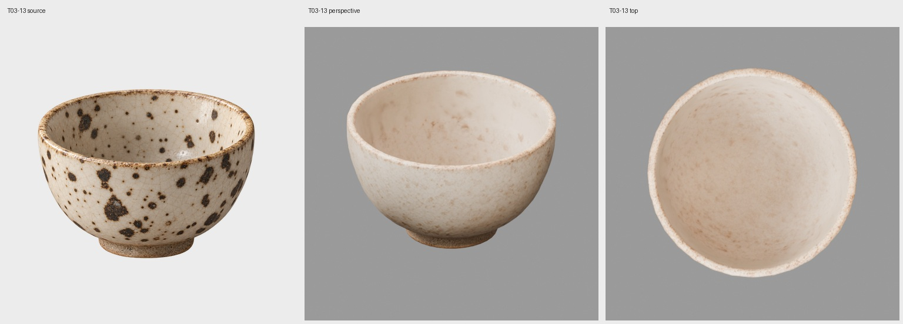

适配版：

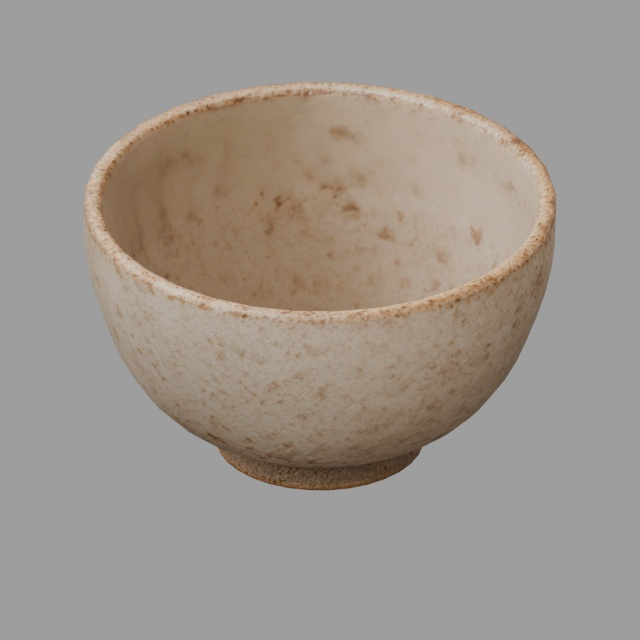

## T03-14 茶托

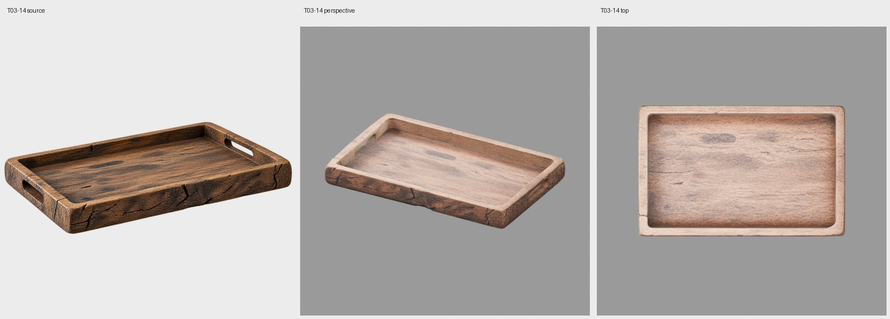

适配版：

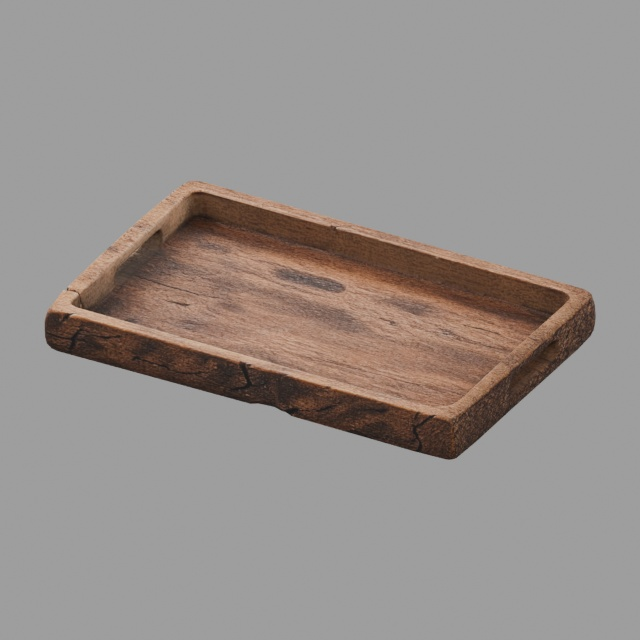

## T03-16 坐垫

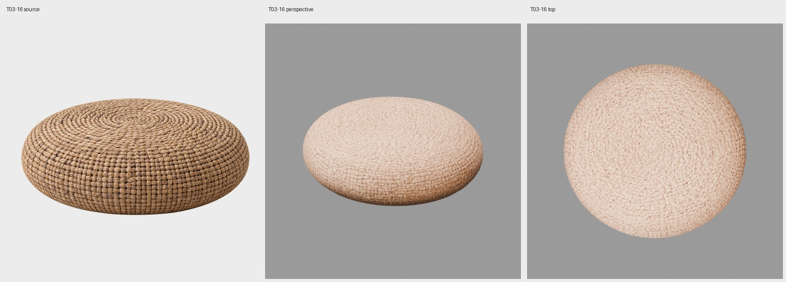

## T03-17 苔藓空钵

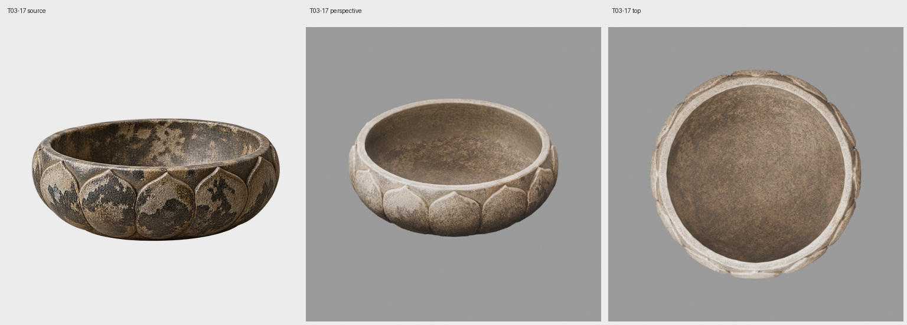

适配版：

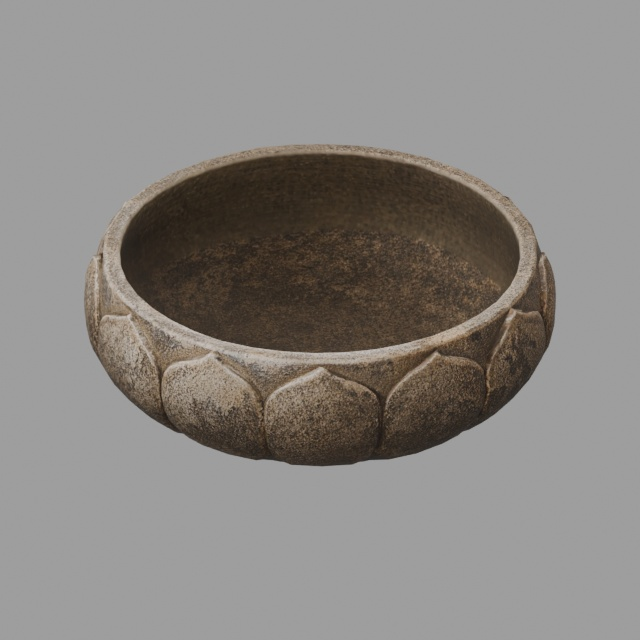

## T03-18 苔藓植被块

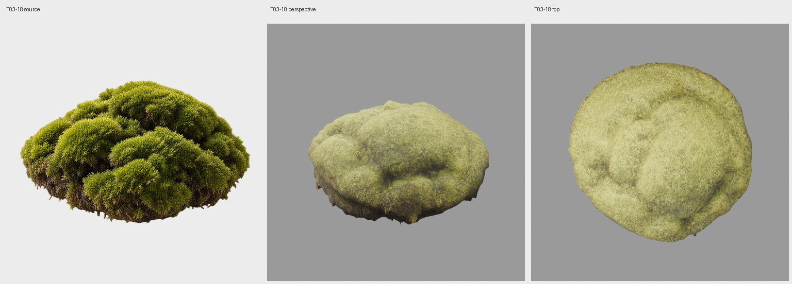

## T03-19 大号纹样空茶碗

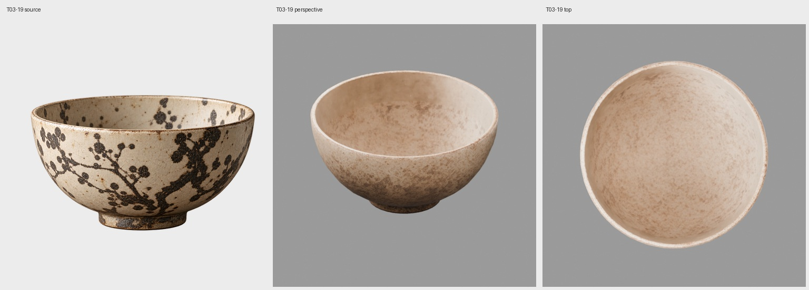

适配版：

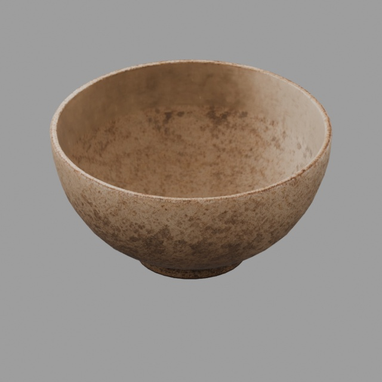

## T03-20 浅色独立杯碟

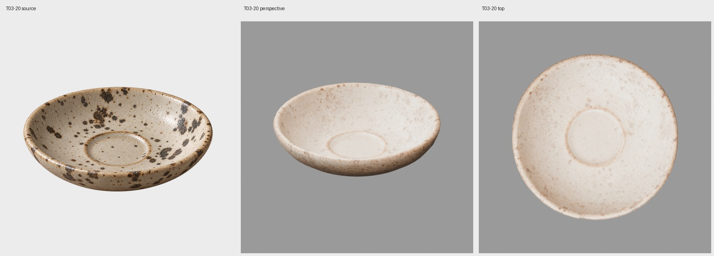

适配版：

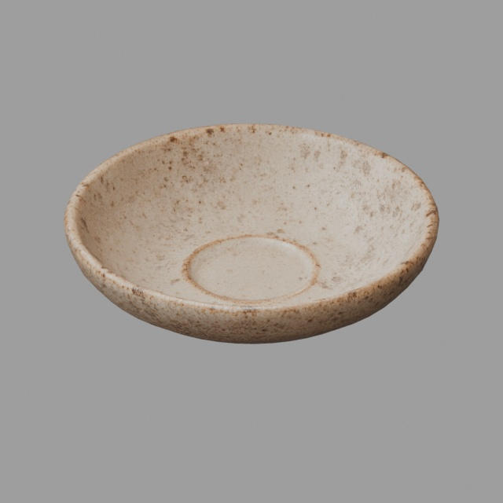

## T03-21 深色金属香炉盖

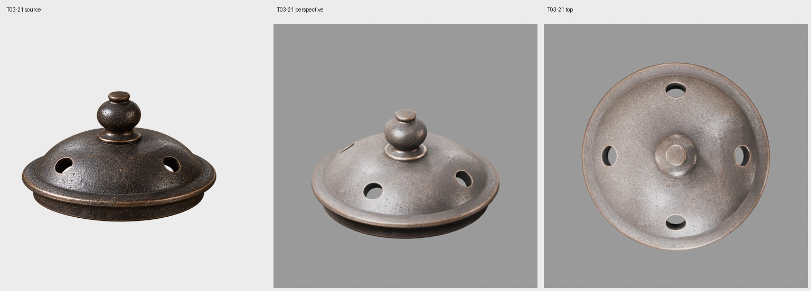

## T03-22 天然纤维地席

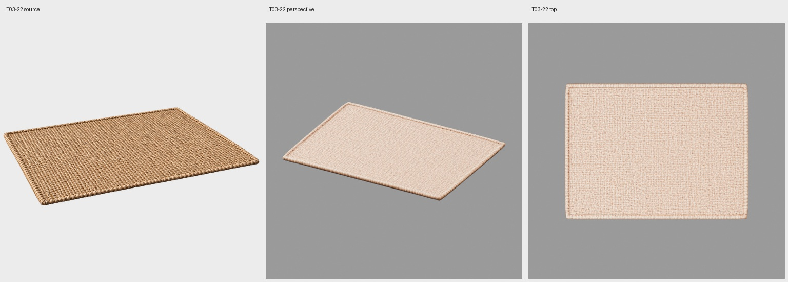

## T03-23 米色纹理挂轴

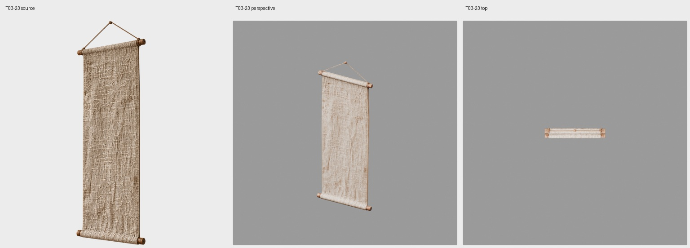

## 组合验证预览

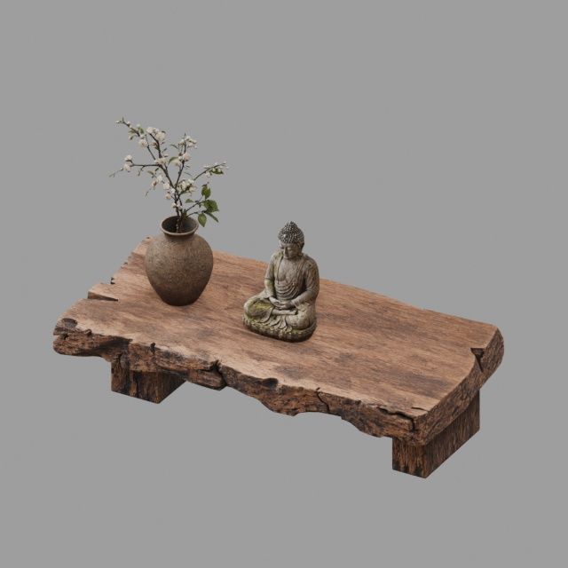

[几何验证报告](combinations/T03-01_T03-02_T03-04_T03-05/409932287e18/report.json)

## 组合验证预览

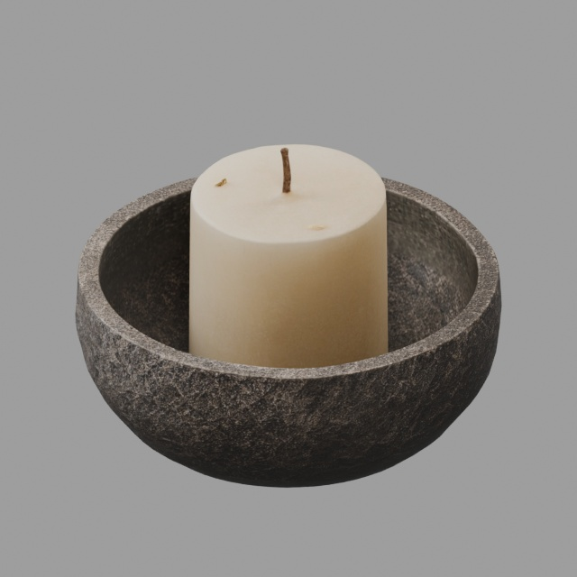

[几何验证报告](combinations/T03-06_T03-07/9871f2282d79/report.json)

## 组合验证预览

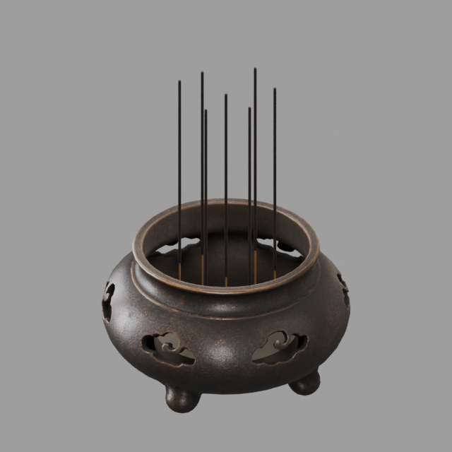

[几何验证报告](combinations/T03-08_T03-09/2a8206672c00/report.json)

## 组合验证预览

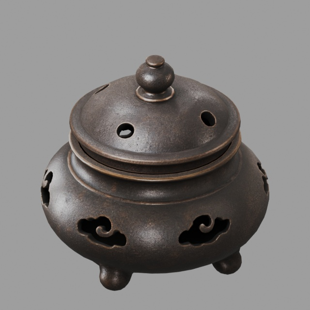

[几何验证报告](combinations/T03-08_T03-21_盖件/7bc8c3e96742/report.json)

## 组合验证预览

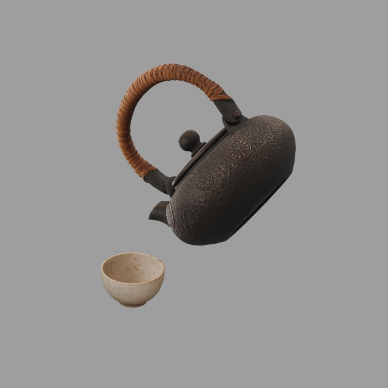

[几何验证报告](combinations/T03-12_T03-13_倾倒姿态/adf1c43be157/report.json)

## 组合验证预览

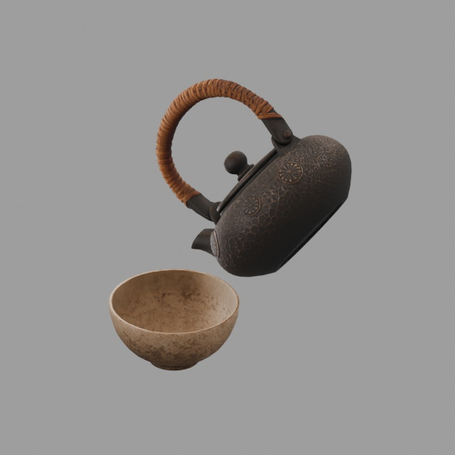

[几何验证报告](combinations/T03-12_T03-19_倾倒姿态/d3e84c9de4e0/report.json)

## 组合验证预览

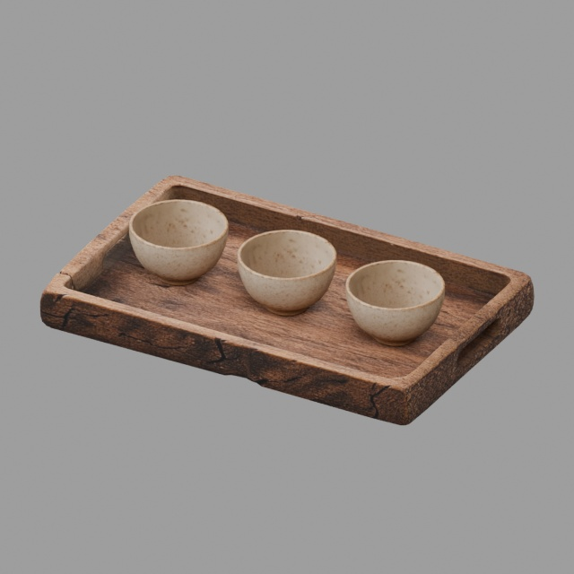

[几何验证报告](combinations/T03-14_T03-13_三杯/44c4fe0f1215/report.json)

## 组合验证预览

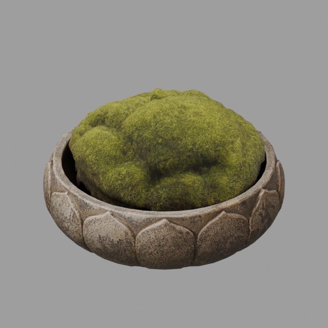

[几何验证报告](combinations/T03-17_T03-18_苔藓摆放/e2360ed58524/report.json)

## 组合验证预览

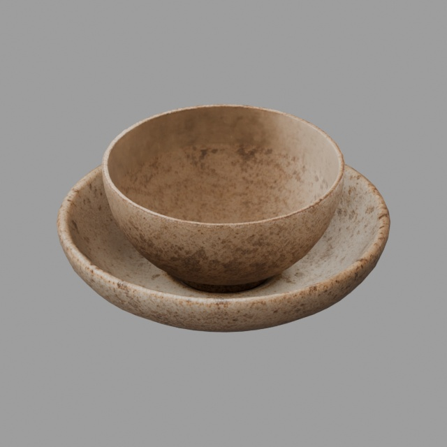

[几何验证报告](combinations/T03-20_T03-19_杯碟承托/244719d85ad5/report.json)

## 组合验证预览

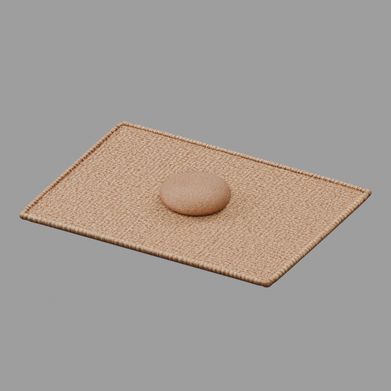

[几何验证报告](combinations/T03-22_T03-16_地席坐垫/e4e2485171fb/report.json)
