# T06 模型检查图

按物件和原始 GLB 的 SHA-256 分版保存。三栏依次为源图、实际模型斜视、实际模型俯视；这些图片仅用于复核，上传不等于验收通过。

## T06-01 供桌或主题主台

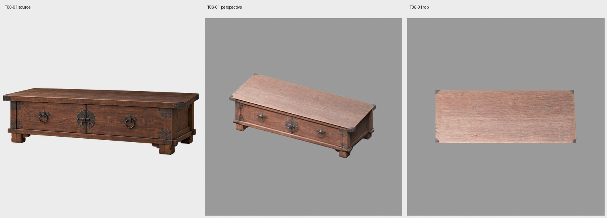

## T06-02 坐佛

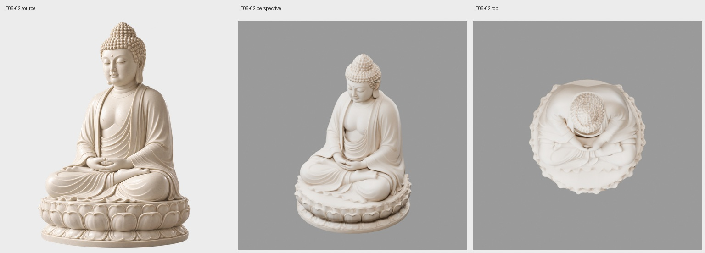

## T06-04 空花瓶

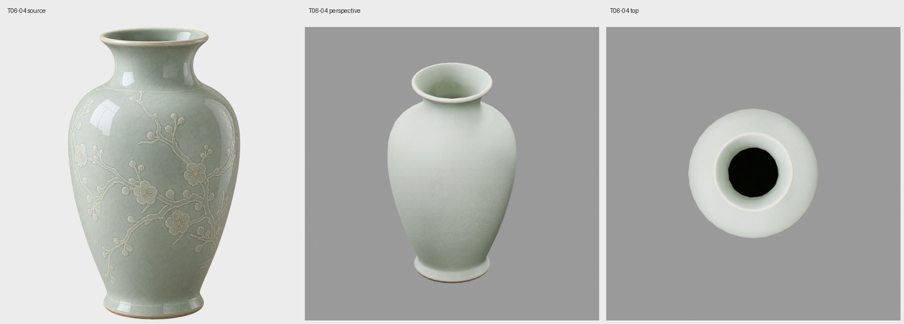

## T06-05 花枝花束

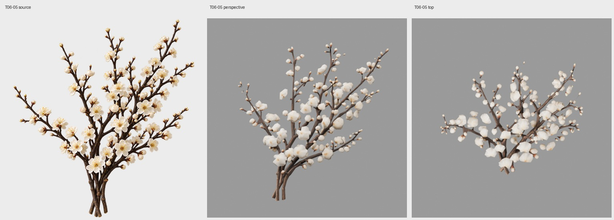

## T06-06 空烛台或灯盏

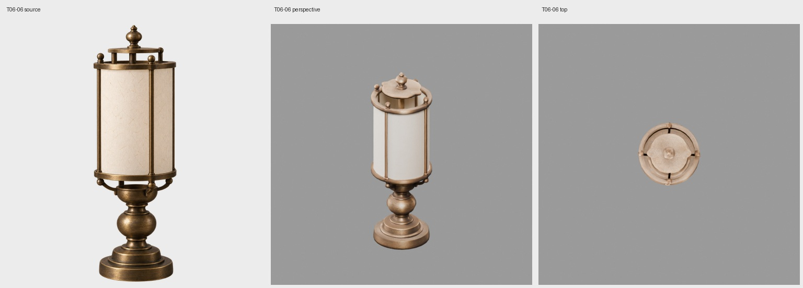

## T06-07 未点燃灯芯

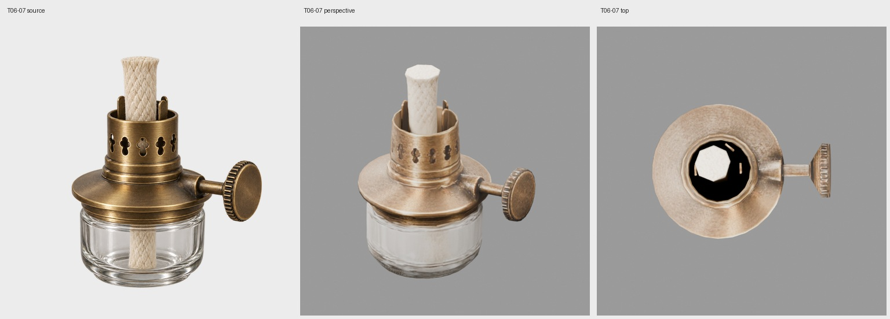

## T06-08 空香炉

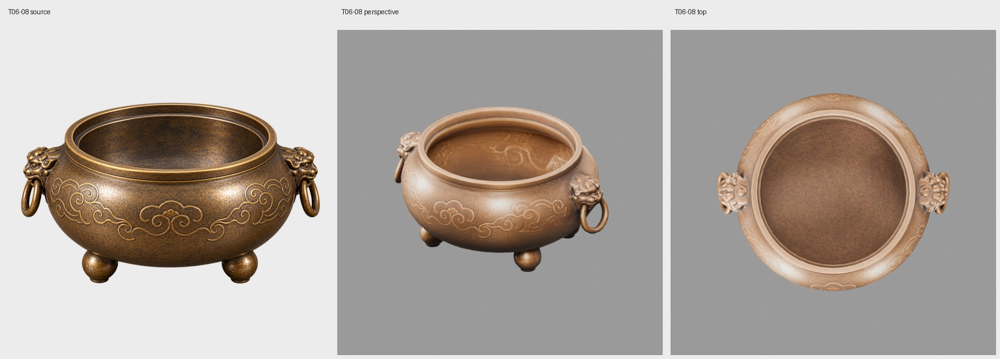

## T06-09 未点燃线香

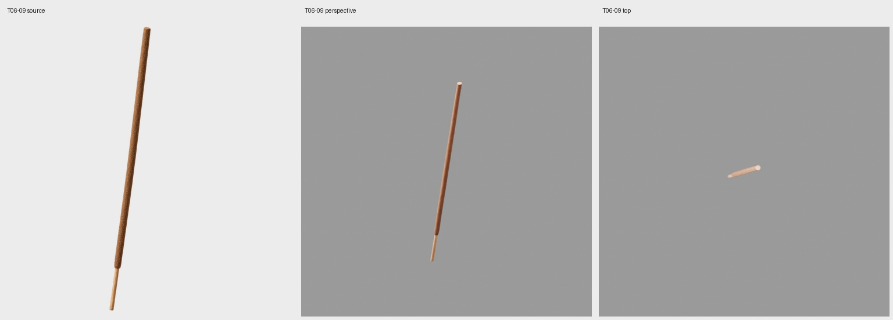

## T06-10 空供盘

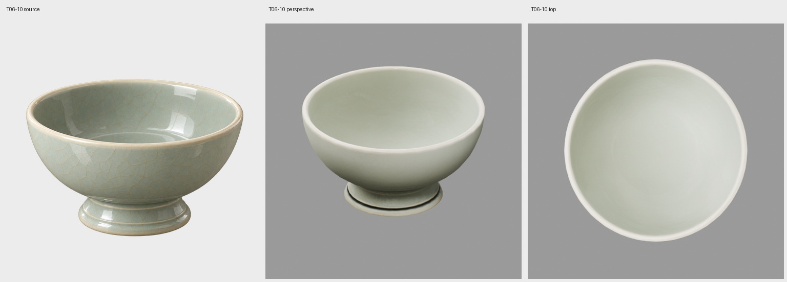

## T06-11 橙子

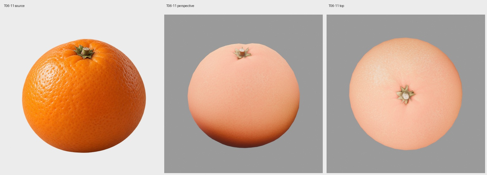

## T06-12 茶壶

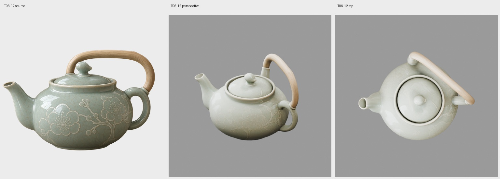

## T06-13 空茶杯

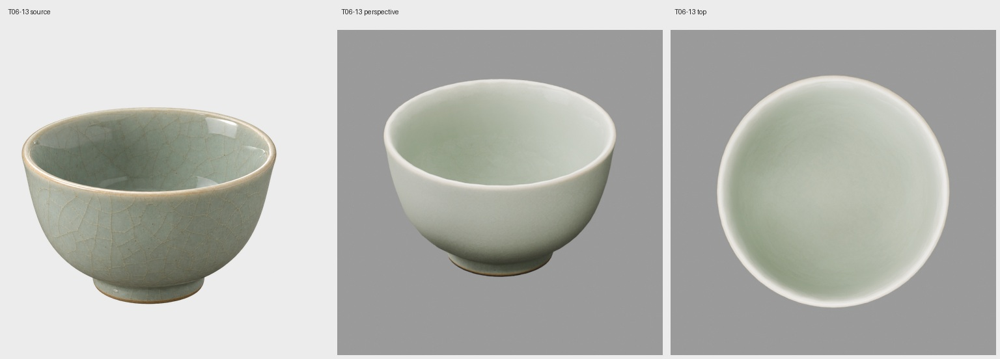

## T06-14 茶托

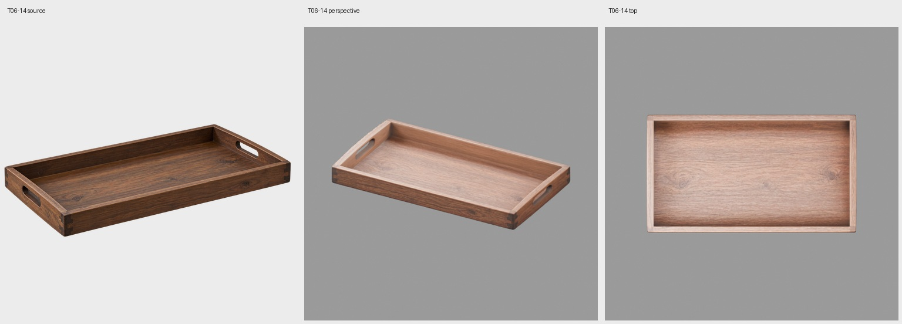

## T06-15 经书

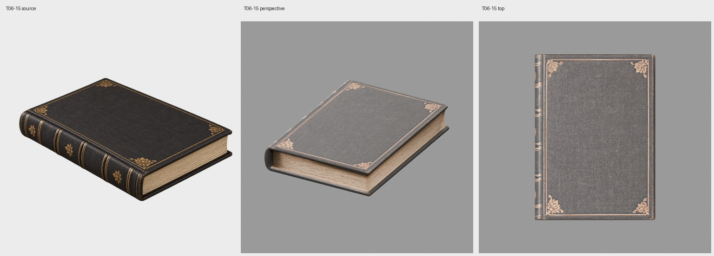

## T06-16 坐垫

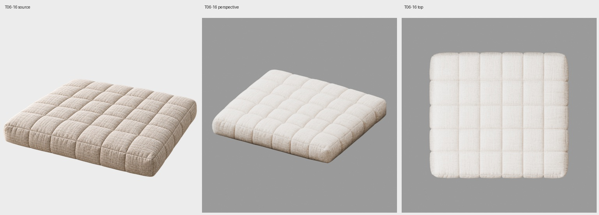

## T06-17 小型黄铜空盖器

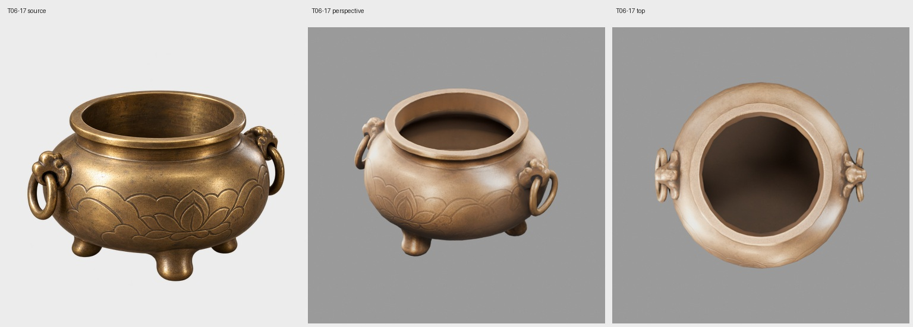

## T06-18 小型黄铜器盖

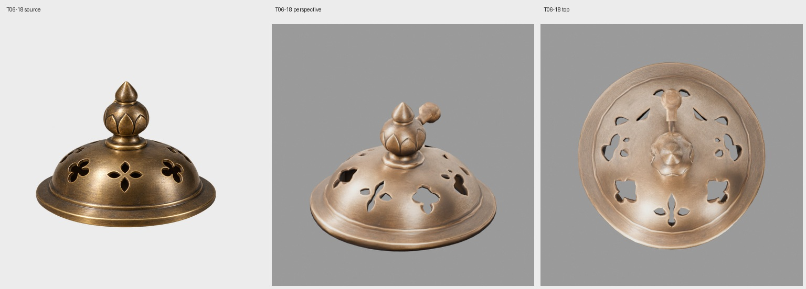

## T06-19 古铜香炉盖

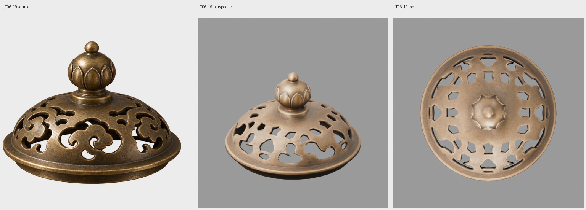

## T06-20 红枣空供碗

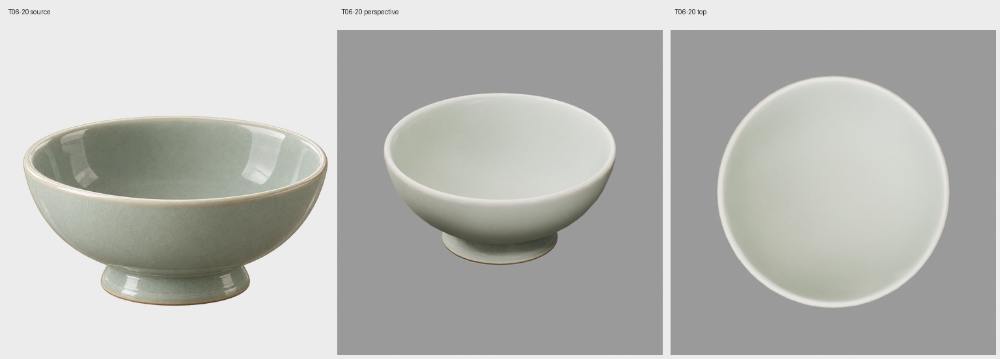

## T06-21 红枣

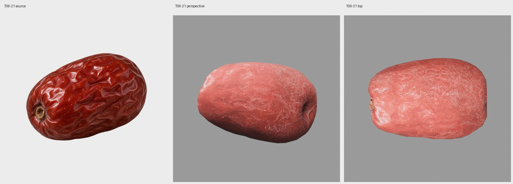

## T06-22 右侧松枝空花瓶

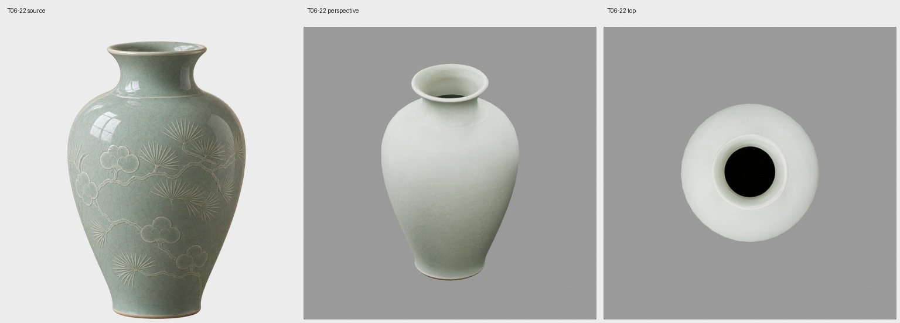

## T06-23 松枝组合

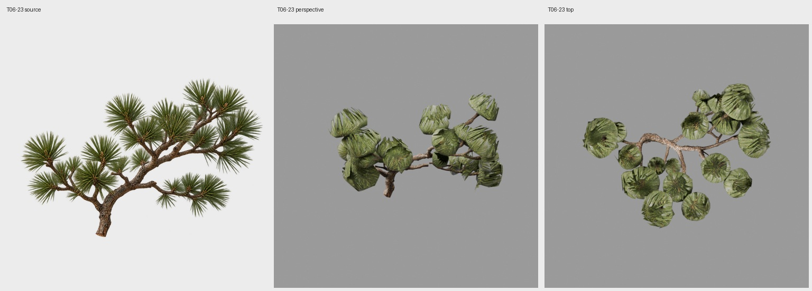

## T06-24 灰色供石

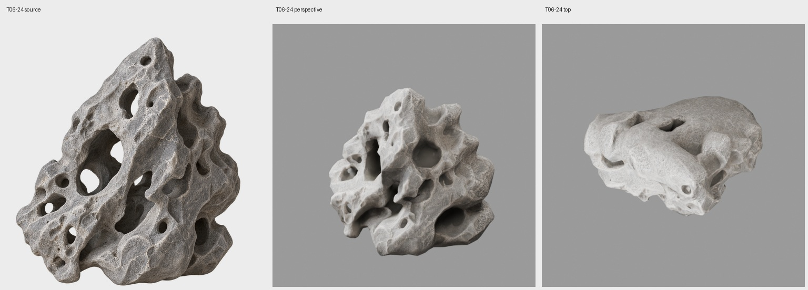

## T06-25 供石木托

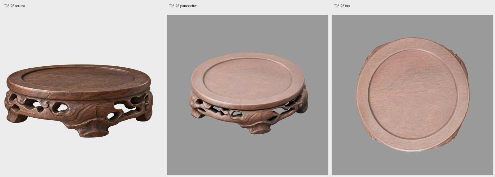

## T06-26 青瓷独立杯碟

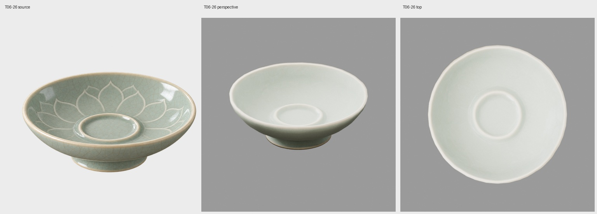

## T06-27 柿子状供果

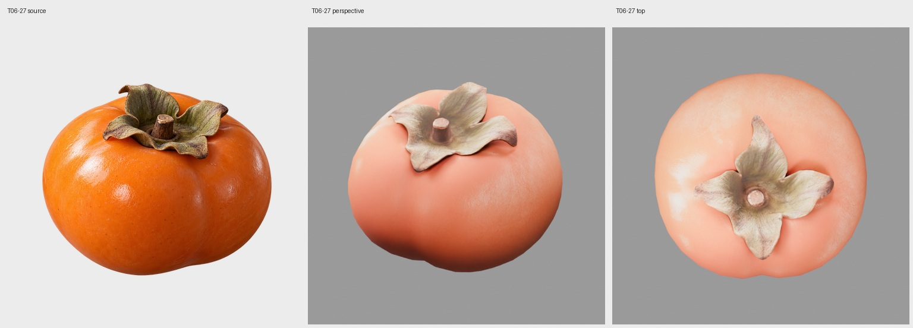

## T06-28 小枝白梅

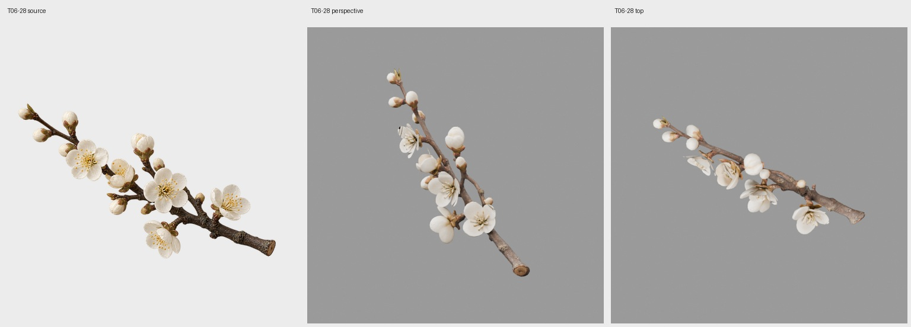

## T06-29 前方独立矮茶案

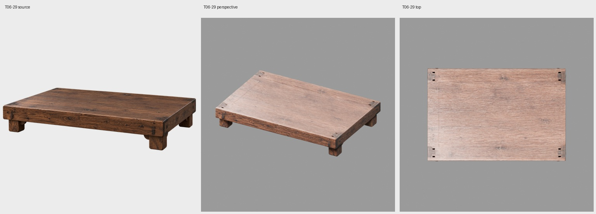

## T06-30 前景独立地毯

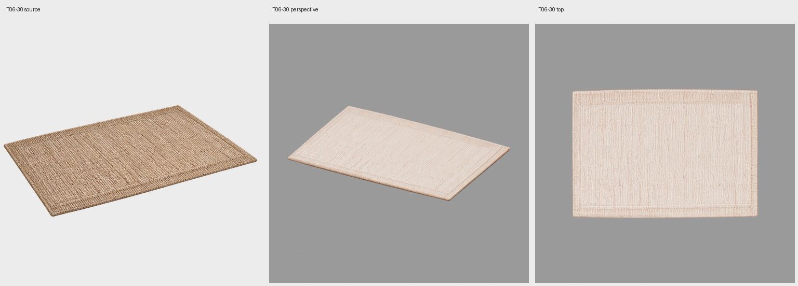
