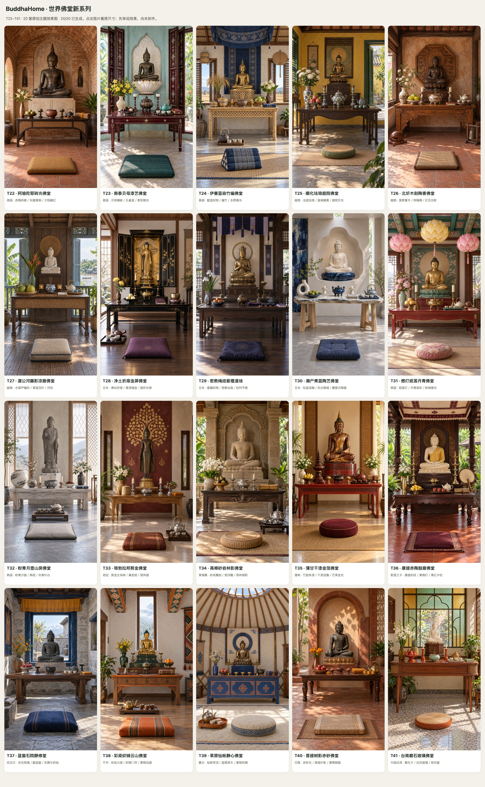
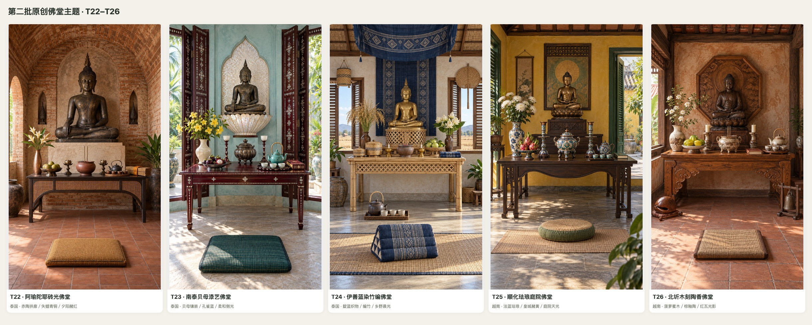
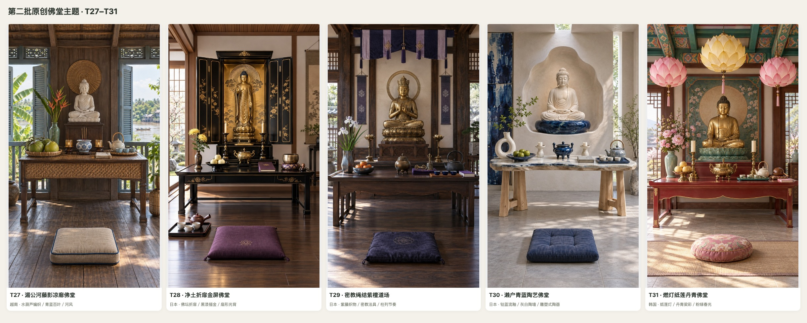
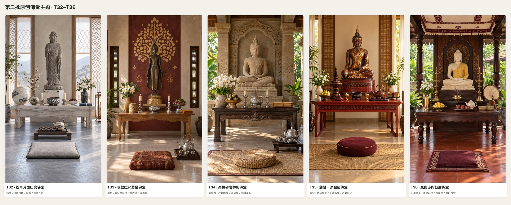
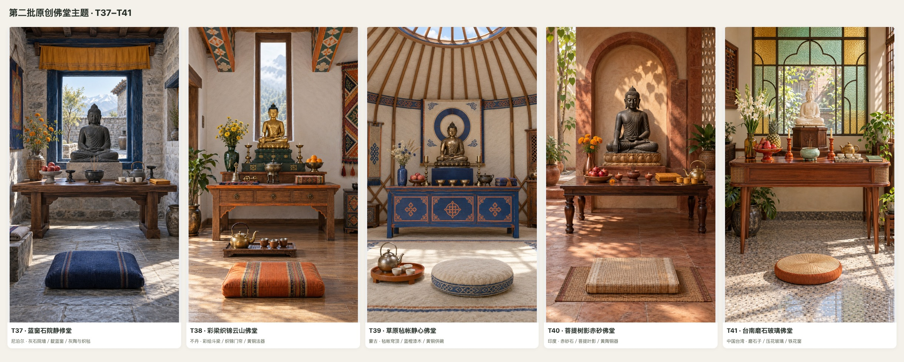

# 第二批：20 套原创佛堂主题效果图

**T22–T41 · 13 个国家与地区 · 20/20 张已生成 · 待用户审阅**

本轮是主题概念效果图，不是已批准方案，也尚未拆分物件。采用独立文字提示生成，未使用上一批主题或物件作为输入。地域文化启发的原创空间，不复刻具体寺院或既有作品。

[下载/打开交互图库 HTML](index.html) · [完整设计与提示词](manifest.json)

## 全部 20 套总览

## 分组大图

### T22–T26

### T27–T31

### T32–T36

### T37–T41

## 原尺寸主题图

| 编号 | 国家 / 地区 | 主题 | 看图 |
|---|---|---|---|
| T22 | 泰国 | 阿瑜陀耶砖光佛堂 | [原图](T22.png) · [快速预览](T22.jpg) |
| T23 | 泰国 | 南泰贝母漆艺佛堂 | [原图](T23.png) · [快速预览](T23.jpg) |
| T24 | 泰国 | 伊善蓝染竹编佛堂 | [原图](T24.png) · [快速预览](T24.jpg) |
| T25 | 越南 | 顺化珐琅庭院佛堂 | [原图](T25.png) · [快速预览](T25.jpg) |
| T26 | 越南 | 北圻木刻陶香佛堂 | [原图](T26.png) · [快速预览](T26.jpg) |
| T27 | 越南 | 湄公河藤影凉廊佛堂 | [原图](T27.png) · [快速预览](T27.jpg) |
| T28 | 日本 | 净土折扉金屏佛堂 | [原图](T28.png) · [快速预览](T28.jpg) |
| T29 | 日本 | 密教绳结紫檀道场 | [原图](T29.png) · [快速预览](T29.jpg) |
| T30 | 日本 | 濑户青蓝陶艺佛堂 | [原图](T30.png) · [快速预览](T30.jpg) |
| T31 | 韩国 | 燃灯纸莲丹青佛堂 | [原图](T31.png) · [快速预览](T31.jpg) |
| T32 | 韩国 | 粉青月壶山房佛堂 | [原图](T32.png) · [快速预览](T32.jpg) |
| T33 | 老挝 | 琅勃拉邦剪金佛堂 | [原图](T33.png) · [快速预览](T33.jpg) |
| T34 | 柬埔寨 | 高棉砂岩林影佛堂 | [原图](T34.png) · [快速预览](T34.jpg) |
| T35 | 缅甸 | 蒲甘干漆金箔佛堂 | [原图](T35.png) · [快速预览](T35.jpg) |
| T36 | 斯里兰卡 | 康提赤陶鼓廊佛堂 | [原图](T36.png) · [快速预览](T36.jpg) |
| T37 | 尼泊尔 | 蓝窗石院静修堂 | [原图](T37.png) · [快速预览](T37.jpg) |
| T38 | 不丹 | 彩梁织锦云山佛堂 | [原图](T38.png) · [快速预览](T38.jpg) |
| T39 | 蒙古 | 草原毡帐静心佛堂 | [原图](T39.png) · [快速预览](T39.jpg) |
| T40 | 印度 | 菩提树影赤砂佛堂 | [原图](T40.png) · [快速预览](T40.jpg) |
| T41 | 中国台湾 | 台南磨石玻璃佛堂 | [原图](T41.png) · [快速预览](T41.jpg) |
